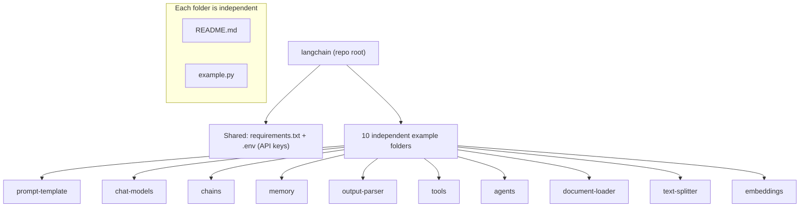

# LangChain Examples

A collection of small, **independent** LangChain examples. This repository is **not** a single chatbot. Each folder demonstrates one LangChain building block, has its own README, and is runnable on its own with minimal dependencies.

The goal is to learn the core LangChain concepts through focused, self-contained scripts.

## Architecture Diagram



Each example follows the same pattern: read configuration from `.env`, build a small LangChain pipeline, and print the result.

## Folder Structure

```
langchain/
├── README.md              # This file (indexes all examples)
├── requirements.txt       # Shared, intended dependencies (text manifest)
├── LICENSE                # MIT
├── .gitignore
├── prompt-template/       # Reusable, parameterized prompts
│   ├── README.md
│   └── example.py
├── chat-models/           # Calling chat models
│   ├── README.md
│   └── example.py
├── chains/                # Composing pipelines with LCEL
│   ├── README.md
│   └── example.py
├── memory/                # Conversational memory
│   ├── README.md
│   └── example.py
├── output-parser/         # Structuring model output
│   ├── README.md
│   └── example.py
├── tools/                 # Custom tools a model can call
│   ├── README.md
│   └── example.py
├── agents/                # Tool-using agents
│   ├── README.md
│   └── example.py
├── document-loader/       # Loading documents
│   ├── README.md
│   └── example.py
├── text-splitter/         # Chunking long text
│   ├── README.md
│   └── example.py
└── embeddings/            # Vector embeddings + similarity
    ├── README.md
    └── example.py
```

## Installation Guide

No Docker is required. Each example runs as a plain Python script.

```bash
# 1. Clone
git clone https://github.com/ranjan-del/langchain.git
cd langchain

# 2. Create and activate a virtual environment
python -m venv .venv
source .venv/bin/activate        # Windows: .venv\Scripts\activate

# 3. Install the shared dependencies
pip install -r requirements.txt

# 4. Add your API keys
cp .env.example .env             # then edit .env
# OPENAI_API_KEY=...
# ANTHROPIC_API_KEY=...

# 5. Run any example
python prompt-template/example.py
```

## Features

| Example | Folder | Demonstrates |
| --- | --- | --- |
| Prompt Template | `prompt-template/` | Reusable, parameterized prompts |
| Chat Models | `chat-models/` | Invoking chat models and reading responses |
| Chains | `chains/` | Composing prompt to model to parser with LCEL |
| Memory | `memory/` | Persisting conversational context |
| Output Parser | `output-parser/` | Structuring raw output into objects |
| Tools | `tools/` | Defining custom callable tools |
| Agents | `agents/` | Models that choose and call tools |
| Document Loader | `document-loader/` | Loading files/URLs into documents |
| Text Splitter | `text-splitter/` | Chunking long documents |
| Embeddings | `embeddings/` | Generating vectors and comparing similarity |

## Screenshots

_Coming soon_

## Demo GIF

_Coming soon_

## API Documentation

This repository contains standalone scripts and does not expose an HTTP API.

_Coming soon_

## Future Improvements

- Fill in each `example.py` with a minimal, runnable implementation.
- Add a `.env.example` template for required API keys.
- Add retrieval-augmented generation (RAG) and vector-store examples.
- Add unit tests for each example.
- Optional: provide a `docker compose up` path to run any example in a container.

## License

Released under the [MIT License](LICENSE).
