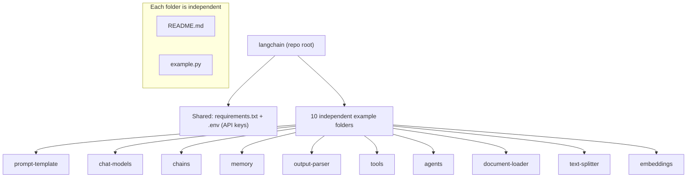

# LangChain Examples

A collection of small, **independent** LangChain examples. This repository is **not** a single chatbot. Each folder demonstrates one LangChain building block, has its own README, and is runnable on its own with minimal dependencies.

The goal is to learn the core LangChain concepts through focused, self-contained scripts.

**Offline-first.** Every example runs with no API key, no network call, and no third-party packages: each script ships a small, deterministic local implementation of the concept (including a fake/echo model where an LLM call would normally go). This keeps every folder runnable and testable out of the box. See the note under [Implementation approach](#implementation-approach).

## Architecture Diagram



Each example follows the same pattern: read configuration from `.env`, build a small LangChain pipeline, and print the result.

## Folder Structure

```
langchain/
├── README.md              # This file (indexes all examples)
├── requirements.txt       # Shared, intended dependencies (text manifest)
├── LICENSE                # MIT
├── .gitignore
├── prompt-template/       # Reusable, parameterized prompts
│   ├── README.md
│   └── example.py
├── chat-models/           # Calling chat models
│   ├── README.md
│   └── example.py
├── chains/                # Composing pipelines with LCEL
│   ├── README.md
│   └── example.py
├── memory/                # Conversational memory
│   ├── README.md
│   └── example.py
├── output-parser/         # Structuring model output
│   ├── README.md
│   └── example.py
├── tools/                 # Custom tools a model can call
│   ├── README.md
│   └── example.py
├── agents/                # Tool-using agents
│   ├── README.md
│   └── example.py
├── document-loader/       # Loading documents
│   ├── README.md
│   └── example.py
├── text-splitter/         # Chunking long text
│   ├── README.md
│   └── example.py
└── embeddings/            # Vector embeddings + similarity
    ├── README.md
    └── example.py
```

## Installation Guide

No Docker is required. Each example runs as a plain Python script.

```bash
# 1. Clone
git clone https://github.com/ranjan-del/langchain.git
cd langchain

# 2. Create and activate a virtual environment
python -m venv .venv
source .venv/bin/activate        # Windows: .venv\Scripts\activate

# 3. Install dependencies (only pytest is required; see requirements.txt)
pip install -r requirements.txt

# 4. (Optional) Add API keys. NOT needed to run anything here; every example
#    runs offline. Only relevant if you extend an example to a hosted model.
cp .env.example .env             # then edit .env
# OPENAI_API_KEY=...
# ANTHROPIC_API_KEY=...

# 5. Run any example (no key required)
python prompt-template/example.py

# 6. Run the test suite
pytest -q
```

## Implementation approach

These examples are written to be **runnable and testable with zero external dependencies**. Where a real LangChain program would call a hosted model, the example substitutes a deterministic local stand-in (for instance a fake/echo chat model, a hashing embedder, or a rule-based agent router). Each script keeps the same public shape as its LangChain counterpart (`PromptTemplate.format`, `chat_model.invoke`, `prompt | model | parser`, `Embeddings.embed`, and so on) so the concept transfers directly. This is a deliberate trade: reproducible, key-free, CI-friendly demonstrations of each building block rather than thin wrappers that only work with a paid API.

## Features

| Example | Folder | Demonstrates |
| --- | --- | --- |
| Prompt Template | `prompt-template/` | Reusable, parameterized prompts |
| Chat Models | `chat-models/` | Invoking chat models and reading responses |
| Chains | `chains/` | Composing prompt to model to parser with LCEL |
| Memory | `memory/` | Persisting conversational context |
| Output Parser | `output-parser/` | Structuring raw output into objects |
| Tools | `tools/` | Defining custom callable tools |
| Agents | `agents/` | Models that choose and call tools |
| Document Loader | `document-loader/` | Loading files/URLs into documents |
| Text Splitter | `text-splitter/` | Chunking long documents |
| Embeddings | `embeddings/` | Generating vectors and comparing similarity |

## Tests

A pytest suite in `tests/` covers every example (at least one behavioural test per example, plus a check that each `main()` runs). All tests run offline.

```bash
pytest -q      # from the repo root
```

Continuous integration runs the same suite on every push and pull request via [`.github/workflows/ci.yml`](.github/workflows/ci.yml).

## Screenshots

Not captured (headless build). The examples are console scripts; run any of them locally to see their output.

## Demo GIF

Not captured (headless build).

## API Documentation

This repository contains standalone scripts and does not expose an HTTP API.

## Status

| Item | Status |
| --- | --- |
| 10 example scripts implemented and runnable | Done |
| Offline-first (no API key required) | Done |
| `.env.example` template | Done |
| pytest suite (per-example tests) | Done (23 tests passing) |
| GitHub Actions CI | Done |
| Screenshots / demo GIF | Not captured (headless build) |

## Future Improvements

- Add retrieval-augmented generation (RAG) and vector-store examples.
- Provide optional variants that call a hosted model when an API key is present.
- Optional: provide a `docker compose up` path to run any example in a container.

## License

Released under the [MIT License](LICENSE).
