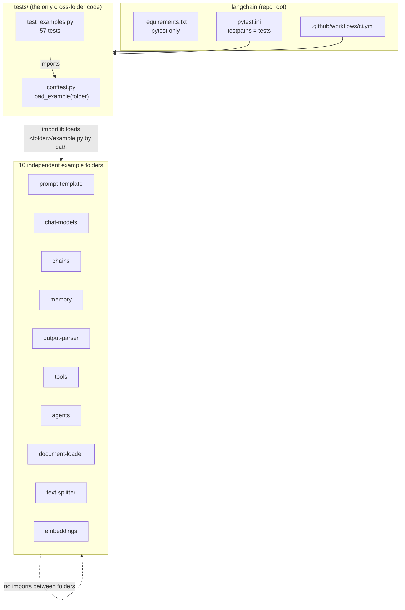

# LangChain Building Blocks, Ten Offline Examples

This repository is **not** a chatbot. It is ten small, independent programs, one per LangChain building
block, each of which runs on its own with **no API key, no network call and no third-party package at
runtime**. Where a real LangChain application would call a hosted model, each example substitutes a
deterministic local stand-in with the same public shape (`PromptTemplate.format`, `model.invoke`,
`prompt | model | parser`, `Embeddings.embed`, and so on). That trade is deliberate: it makes every
concept reproducible, free to run, testable in CI, and readable in a single sitting, which is what a
learning repository needs. The cost, stated plainly, is that no example proves anything about a real
model's behaviour.

## Concepts demonstrated

- **Prompt templates**: named placeholders, input-variable discovery, partial binding, and multi-message
  chat prompts that share one variable dict.
- **Chat models**: role-tagged message lists, `invoke`, token `stream`, and `batch` over isolated
  conversations.
- **Chains**: LCEL-style `|` composition, `batch` over a whole composed chain, and parallel fan-out to
  named branches.
- **Memory**: three real strategies (full buffer, sliding window, lossy summary) compared on one script,
  so the recall-versus-prompt-size trade-off is visible rather than asserted.
- **Output parsers**: list, key/value and JSON parsing, markdown code-fence tolerance,
  `get_format_instructions()`, and a dedicated exception type for unparseable output.
- **Tools**: a `@tool` decorator, JSON Schema derived from type hints, and catchable argument errors.
- **Agents**: runtime tool selection, honest "no tool matched" refusal, and a multi-step scratchpad loop
  where each observation feeds the next decision.
- **Document loaders**: `Document` records with provenance metadata, directory loading, and per-row CSV
  loading.
- **Text splitters**: a blind fixed window versus a recursive separator-aware splitter, and why the
  second is the default in practice.
- **Embeddings**: deterministic hashing vectors, cosine similarity, and an in-memory vector store with
  top-k search.
- **Testing practice**: 57 pytest tests that load hyphenated example folders via `importlib`, assert real
  behaviour rather than smoke-run, and complete in well under a second.

## Architecture

There is no shared application. Every folder is a leaf that imports nothing from its siblings. The only
thing spanning the repo is the test harness, which loads each `example.py` by path.



Inside a folder, the shape is always the same. `example.py` defines the concept's classes and functions,
plus a `main()` that exercises them and prints the result. Nothing is hidden behind a framework:

```
python <folder>/example.py
        |
        v
    main()  ---> builds the concept's objects
        |
        v
    prints a deterministic trace to stdout
```

The ten concepts are independent as code, but they do line up with the stages of a real retrieval
pipeline. That ordering is useful when reading them:

```
document-loader --> text-splitter --> embeddings --> (retrieval)
                                                          |
prompt-template --> chat-models --> output-parser <-------+
        |                |
        +---> chains ----+---> tools ---> agents
```

## Tech stack

| Component | Technology | Why this choice |
| --- | --- | --- |
| Language | Python 3.10+ | Needed for `X \| Y` union syntax and `inspect.signature(..., eval_str=True)`, used in `agents/example.py` and `tools/example.py` |
| Runtime dependencies | None (standard library only) | The whole point is that every folder is independently runnable with nothing installed. Adding `langchain` would make offline execution impossible without a provider key |
| Test runner | `pytest` | The single entry in `requirements.txt`. Chosen for plain `assert`, the `capsys` fixture used to verify each `main()`, and `pytest.raises` for the error paths |
| Test module loading | `importlib.util` (`tests/conftest.py`) | Folder names contain hyphens, so `prompt-template` is not an importable package name. `spec_from_file_location` loads `example.py` by path instead |
| Data records | `dataclasses` | Used for `Message`, `Document`, `Chunk`, `Tool`, `AgentStep`, `ConversationBufferMemory` and `InMemoryVectorStore`. Gives free `__init__`, `__repr__` and `__eq__`, keeping the teaching code short |
| Type introspection | `inspect` | `tools/example.py` derives each tool's JSON Schema from the function signature, so schema and implementation cannot drift apart |
| Pattern matching | `re` | Placeholder discovery in `prompt-template`, arithmetic and quoted-phrase extraction in `agents`, code-fence stripping in `output-parser` |
| Hashing / vector math | `hashlib`, `math` | `embeddings/example.py` buckets MD5 word hashes into a fixed-size vector and L2-normalizes it with `math.sqrt`, giving reproducible vectors with no model download |
| Structured formats | `json`, `csv` | `JsonOutputParser` and `CSVLoader` respectively. Both are the format the real LangChain equivalents target |
| Filesystem fixtures | `os`, `tempfile` | `document-loader/example.py` writes real sample files to a temp directory so the loader reads a genuine file rather than a mocked one |
| Streaming type | `collections.abc.Iterator` | Types `FakeChatModel.stream`, making it explicit that streaming yields fragments rather than returning a whole string |
| CI | GitHub Actions (`.github/workflows/ci.yml`) | Runs `pip install -r requirements.txt` then `pytest -q` on Python 3.12 for every push and pull request |

## Folder structure

```
langchain/
├── README.md                  # This file, indexes and explains every example
├── MEMORY.md                  # The working spec this repo is built against
├── LICENSE                    # MIT
├── requirements.txt           # pytest, plus the optional real LangChain stack commented out
├── pytest.ini                 # testpaths = tests, addopts = -q
├── .env.example               # Optional key template; nothing here needs it
├── .github/workflows/ci.yml   # Install deps, run pytest on every push and PR
├── prompt-template/           # Reusable parameterized prompts, string and chat
│   ├── README.md              # Concept notes and how to run this folder alone
│   └── example.py             # PromptTemplate, ChatPromptTemplate
├── chat-models/               # Role-tagged messages in, AI message out
│   ├── README.md
│   └── example.py             # Message, FakeChatModel (invoke / stream / batch)
├── chains/                    # LCEL-style pipelines built with `|`
│   ├── README.md
│   └── example.py             # Runnable, prompt/model/parser steps, parallel fan-out
├── memory/                    # Carrying conversation state across stateless calls
│   ├── README.md
│   └── example.py             # Buffer, window and summary memory compared
├── output-parser/             # Raw model text into structured Python objects
│   ├── README.md
│   └── example.py             # List, key-value and JSON parsers, OutputParserException
├── tools/                     # Functions a model can be told how to call
│   ├── README.md
│   └── example.py             # @tool decorator, args_schema, ToolInvocationError
├── agents/                    # Choosing and sequencing tools at runtime
│   ├── README.md
│   └── example.py             # Tool registry, router, multi-step scratchpad loop
├── document-loader/           # Sources into Document records
│   ├── README.md
│   └── example.py             # Document, TextLoader, TextDirectoryLoader, CSVLoader
├── text-splitter/             # Long text into model-sized chunks
│   ├── README.md
│   └── example.py             # CharacterTextSplitter, RecursiveCharacterTextSplitter
├── embeddings/                # Text into vectors, and searching them
│   ├── README.md
│   └── example.py             # HashingEmbedder, cosine_similarity, InMemoryVectorStore
└── tests/
    ├── conftest.py            # load_example(), the importlib path loader
    └── test_examples.py       # 57 tests, at least four per example folder
```

### Data flow between them

There is none at import time, and that is a design property rather than an omission. `tests/conftest.py`
is the only module that reaches across folders. Read a folder top to bottom and you have the whole story
for that concept.

## Codebase walkthrough

Every `example.py` follows the same layout: a module docstring stating the concept and why the offline
stand-in is acceptable, then the classes and functions, then a `main()` that prints a deterministic
trace, then the `if __name__ == "__main__"` guard.

### `tests/conftest.py`

One function, `load_example(folder)`. Example folders are named with hyphens, so `import prompt-template`
is a syntax error. The helper builds a path (`ROOT / folder / "example.py"`), creates a module spec with
`importlib.util.spec_from_file_location`, and registers the module in `sys.modules` under a sanitized
name (`example_prompt_template`) **before** calling `spec.loader.exec_module`. The registration order is
load-bearing: from Python 3.12 onwards, dataclass annotation resolution looks the defining module up in
`sys.modules`, so executing first would break every dataclass in the repo.

### `prompt-template/example.py`

`PromptTemplate` is a one-field dataclass wrapping a template string.

- `input_variables` scans the template with `re.findall(r"\{(\w+)\}", ...)` and de-duplicates while
  preserving first-seen order, so the caller learns what to supply.
- `format(**kwargs)` compares the declared variables against the supplied keys and raises `KeyError`
  listing exactly what is missing, then delegates to `str.format`. Failing loudly beats rendering a prompt
  with a literal `{topic}` still in it and paying a model to be confused by it.
- `partial(**kwargs)` substitutes the given placeholders and returns a **new** `PromptTemplate` for the
  remainder, so the original is untouched and reusable.

`ChatPromptTemplate` holds an ordered list of `(role, PromptTemplate)` pairs.
`ChatPromptTemplate.from_messages([(role, text), ...])` builds it from raw strings the way LangChain does.
`input_variables` returns the union across every message, and `format_messages(**kwargs)` renders them all
from the same dict, which is why a variable used in both the system and human message is only supplied
once. `build_examples()` returns `(description, rendered)` pairs for the string cases, `build_chat_prompt()`
returns the chat case, and `main()` prints both.

### `chat-models/example.py`

`Message` is a `(role, content)` dataclass; `system()`, `human()` and `ai()` are constructors for the three
roles. Representing a conversation as an explicit list matters because chat models are stateless: prior
assistant turns only exist if you pass them back in as `ai` messages.

`FakeChatModel` is the offline stand-in.

- `invoke(messages)` finds the system message and the *most recent* human message (scanning `reversed`),
  and returns an `ai` `Message` composed from both. Deterministic by construction, which is what lets the
  tests assert exact strings.
- `stream(messages)` calls `invoke` and yields the reply split on spaces, re-attaching the leading space to
  every token after the first. The invariant that matters is asserted in the tests and printed by `main()`:
  `"".join(stream(c)) == invoke(c).content`. A streaming API that does not reassemble to the same answer is
  a bug.
- `batch(conversations)` maps `invoke` over a list of independent conversations. `main()` demonstrates the
  isolation: the first batched conversation has no system message and its reply carries no persona, while
  the second one does.

`get_chat_model()` checks for `OPENAI_API_KEY` or `ANTHROPIC_API_KEY` and returns a differently *named*
fake either way. It is a seam showing where a hosted client would be constructed, and its docstring and
name say so rather than pretending otherwise.

### `chains/example.py`

`Runnable` wraps a callable and a name.

- `invoke(value)` calls the function.
- `__or__(other)` returns a new `Runnable` whose function is `other.invoke(self.invoke(x))`, and whose name
  is `f"{self.name}|{other.name}"`. This is why the composed chain reports itself as `prompt|model|parser`.
- `batch(values)` maps `invoke` over a list, so an entire composed chain is reusable across inputs.

Three factories build the classic stages: `prompt_step(template)` formats a variable dict into a string,
`model_step()` wraps the offline `fake_model` that returns `MODEL_OUTPUT<...>`, and `parser_step()` strips
that wrapper and title-cases the payload. `build_chain()` pipes them together. `parallel_step(branches)` is
the `RunnableParallel` equivalent: it runs a dict of named branches over the same input and returns a dict
of results. `build_parallel_chain()` uses it to run `parser_step()` and a raw `len` over the identical model
output, which is why `raw_length` (67, measured on `MODEL_OUTPUT<...>`) exceeds the length of `parsed`.

Data flow: `{"topic": ..., "audience": ...}` to formatted prompt string to `MODEL_OUTPUT<...>` to either a
title-cased string or a `{parsed, raw_length}` dict.

### `memory/example.py`

`ConversationBufferMemory` is a dataclass holding `turns: list[tuple[str, str]]`, with `add_user`, `add_ai`
and `buffer()` (the whole history joined as `role: text` lines). The two other strategies subclass it and
override only `buffer()`, which is the cleanest way to show that they differ solely in what they choose to
retain:

- `ConversationBufferWindowMemory(k)` renders only `turns[-k:]`. The prompt stays bounded forever, but
  anything older is genuinely gone.
- `ConversationSummaryMemory(k)` adds `summary()`, which describes the dropped turns in one line
  (`[summary of N earlier turn(s) by ...]`), and prepends it to the last `k` turns. LangChain writes that
  summary with an LLM; this one counts turns and lists speakers so it stays offline and deterministic.

`MemoryAwareModel.respond(memory, user_text)` lowercases `memory.buffer()`, and if it contains
`"my name is"` while the current question mentions a name, it recovers the word after that phrase and
answers. The point is that the recall lives in the **memory**, not the model.

`replay(memory)` feeds the same four-turn `LONG_SCRIPT` to any strategy, and `compare_memories()` returns
each strategy's final answer. The result printed by `main()` is the honest lesson: only `buffer` answers
`"Your name is Ada."`. The window dropped the introduction, and the lossy summary never contained the name,
so both answer `"Noted: 'What is my name?'"`.

### `output-parser/example.py`

`OutputParserException(ValueError)` exists so a caller can distinguish "the model answered badly, retry"
from a genuine bug in its own code. All three parsers expose `get_format_instructions()`, which is the
half of the abstraction that is easy to miss: the parser both tells the model what shape to answer in
(that text goes into the prompt) and reads the shape back.

- `CommaSeparatedListParser.parse` splits on commas, strips each item, and drops empties.
- `JsonOutputParser.parse` first applies the `_FENCE` regex (```` ```json ... ``` ````, `re.DOTALL`) because
  models wrap JSON in a markdown fence even when told not to. A parser that only calls `json.loads` rejects
  output that is actually correct. It then raises `OutputParserException` on a `JSONDecodeError` **and** on
  valid JSON of the wrong shape, such as a top-level list.
- `KeyValueParser.parse` splits each line on the first colon with `str.partition`, skips lines without one,
  and coerces integer-looking values with `value.lstrip("-").isdigit()`, so `born: 1815` becomes the int
  `1815`.

`build_examples()` runs all three over fixed sample text, deliberately including a fenced JSON string.
`main()` prints the parsed objects, the format instructions, and a caught `OutputParserException`.

### `tools/example.py`

`Tool` is a dataclass of `name`, `description` and `func`. The `@tool` decorator sets the name from
`func.__name__` and the description from the docstring's first line, matching how LangChain derives tool
metadata, and returns the `Tool` in place of the function.

- `args` lists the parameter names.
- `args_schema` builds a JSON Schema object from `inspect.signature(self.func, eval_str=True)`. The
  `eval_str=True` is required: this module uses `from __future__ import annotations`, so without it every
  annotation would arrive as the string `"int"` and match nothing in the `_JSON_TYPES` map. Parameters
  without a default land in `required`, which is why `repeat`'s `times` is present in `properties` but
  absent from `required`. Deriving the schema from the signature means it cannot drift from the code.
- `invoke(**kwargs)` validates before calling: unknown keys and missing required keys each raise
  `ToolInvocationError` naming the offending fields. A model passing wrong arguments is a normal event in
  an agent loop, so it must be catchable rather than a raw `TypeError`.

`add`, `word_count` and `repeat` are the registered tools; `get_tools()` returns the toolbox and `main()`
prints each signature, the JSON schema a provider would receive, and a caught bad call.

### `agents/example.py`

The tool registry is `TOOLS`, a dict of name to `Tool(name, func)`, where every function takes the query
string and returns a string.

- `_calculator` matches `(-?\d+)\s*([\+\-\*/])\s*(-?\d+)` and computes the result, guarding division by
  zero and normalizing `4/2` to `2` rather than `2.0`. It uses a regex rather than `eval` on purpose: a
  tool runs whatever the model asked for, so an arbitrary Python evaluator behind it is a real
  remote-code-execution hole.
- `_length` and `_reverse` operate on the quoted phrase if the query contains one, otherwise the whole
  query.

`route(query)` is the offline stand-in for LLM reasoning. It checks explicit intent words first
(`reverse`/`backwards`, then `how long`/`length`/`how many characters`) and only then the `ARITHMETIC`
pattern, so `reverse '3+4'` is not hijacked by the calculator. It returns `None` when nothing matches.
That return value is a deliberate correction: an earlier version fell through to the `length` tool, which
meant the agent silently answered every unrecognised question with a character count. `run_agent(query)`
turns `None` into an explicit `chosen_tool: "none"` and `"No tool matched this request."`.

`plan(query)` returns an **ordered list** of tools for multi-intent requests, and `run_agent_loop(query,
max_steps=4)` executes them as a scratchpad: after each step it records an `AgentStep(thought, tool,
observation)` and sets the next input to the quoted observation. Running it on
`"Reverse 'langchain' and tell me how long the result is."` gives step 1 `reverse` producing `niahcgnal`,
then step 2 `length` measuring **that** string rather than the original query. `max_steps` bounds the loop
because a model-driven agent can otherwise cycle indefinitely. This iterative decide, act, observe cycle is
the thing that makes an agent different from the fixed pipeline in `chains/`.

### `document-loader/example.py`

`Document` is a dataclass of `page_content` and a `metadata` dict, matching
`langchain_core.documents.Document`. Three loaders share a `load() -> list[Document]` interface:

- `TextLoader(path)` reads one UTF-8 file into one document, recording `source` and `chars`.
- `TextDirectoryLoader(directory)` calls `TextLoader` for every `.txt` in `sorted(os.listdir(...))`. The
  sort is what makes the output order deterministic and therefore testable.
- `CSVLoader(path)` uses `csv.DictReader` to emit one document **per row**, with `page_content` rendered as
  `column: value` lines and the 1-based row number in metadata. Keeping the row number out of the text and
  in metadata is the point: retrieval can cite the exact row without the citation polluting the content
  that gets embedded.

`write_samples(directory)` writes the two `.txt` fixtures and one `.csv`. `load_sample_documents()` uses
`tempfile.mkdtemp` and returns the `.txt` documents (the directory loader filters the CSV out).
`load_sample_csv()` uses a `tempfile.TemporaryDirectory` context manager instead, so the directory is
removed before returning. The documents are already fully in memory at that point, so nothing is lost, and
the example stops littering the system temp folder on every run.

### `text-splitter/example.py`

`Chunk` is a dataclass of `text`, `start` and `end`.

`CharacterTextSplitter(chunk_size, chunk_overlap)` rejects `chunk_overlap >= chunk_size` in `__init__`
(otherwise the window would never advance) and slides a fixed window with `step = chunk_size -
chunk_overlap`, recording each chunk's exact span. It is blind to word and sentence boundaries, which the
printed output makes obvious: its first chunk ends at `"Overlap keeps context f"`.

`RecursiveCharacterTextSplitter` is LangChain's default and the one to reach for. Its separator list runs
coarsest to finest, `["\n\n", "\n", ". ", " ", ""]`.

- `_split(text, separators)` returns the text unchanged if it already fits, otherwise splits on the first
  separator, re-attaches that separator to every piece but the last so the pieces rejoin exactly, and
  recurses with the remaining separators on any piece still too large. The empty-string separator is the
  last resort and means a hard mid-word cut, which is better than emitting an oversized chunk.
- `_merge(pieces)` greedily packs pieces back up to `chunk_size`, carrying the previous chunk's tail
  forward as overlap. It only carries that tail when `len(tail) + len(piece) <= chunk_size`; otherwise the
  overlap is dropped. `chunk_size` is a hard bound and the overlap is a best-effort nicety, and getting
  this wrong is how the earlier version emitted an 81-character chunk under an 80-character limit.
- `split_text(text)` runs both and returns plain strings, **not** `Chunk` records. Once pieces are merged
  and an overlap tail is prepended, a chunk no longer corresponds to one contiguous span of the source, so
  reporting a start and end offset would be a lie.

`split_sample()` and `split_sample_recursively()` apply each splitter to the module-level `SAMPLE` so
`main()` can print them side by side.

### `embeddings/example.py`

`HashingEmbedder(dim)` lowercases and splits the text, MD5-hashes each token, takes `int(digest, 16) % dim`
as a bucket index, increments that bucket, and L2-normalizes with `math.sqrt`. Empty text has no norm to
divide by, so it returns the zero vector rather than raising. Normalizing at embed time is what lets
`cosine_similarity(a, b)` be a bare dot product, `sum(x * y for x, y in zip(a, b))`.

`most_similar(query, documents, embedder)` scores every document and returns the best `(text, score)`.
`InMemoryVectorStore` is the piece that turns an embedder into retrieval: `add_texts` embeds each document
**once** and stores text and vector in parallel lists, and `similarity_search(query, k)` embeds only the
query, scores against the stored vectors, sorts descending and returns the top `k`. Embedding at insert
time rather than per query is the entire reason vector stores exist. The scan is linear, which is correct
and fast for a handful of documents; real stores add an approximate-nearest-neighbour index because linear
scan stops being viable somewhere in the millions.

### `tests/test_examples.py`

One section per example folder, each with behavioural assertions plus a `main()` smoke test using the
`capsys` fixture to confirm the script printed its banner. The behavioural tests pin real invariants:
stream tokens reassemble to `invoke`'s content, batched conversations stay isolated, chunks never exceed
`chunk_size`, zero-overlap recursive chunks rejoin into the exact original `SAMPLE`, the agent's second
loop step measures the first step's observation, and the CSV loader's temp directory is gone by the time
the documents are returned.

## Installation

No Docker, no build step, no API key.

```bash
# 1. Clone
git clone https://github.com/ranjan-del/langchain.git
cd langchain

# 2. Create and activate a virtual environment (Python 3.10+)
python3 -m venv .venv
source .venv/bin/activate        # Windows: .venv\Scripts\activate

# 3. Install dependencies (pytest only; see requirements.txt)
pip install -r requirements.txt

# 4. Run any example
python prompt-template/example.py

# 5. Run the test suite
pytest
```

Step 4 needs nothing from step 3. The examples import only the standard library, so
`python3 prompt-template/example.py` works in a bare checkout with no virtual environment at all. `pytest`
is required for step 5 only.

The optional `.env.example` template exists for people extending an example to a hosted model. Copy it with
`cp .env.example .env` if you want it. Nothing loads the `.env` file itself; `chat-models/example.py` only
checks whether an API key variable is set in the environment, and stays offline either way.

## Usage

Each folder is one command. The output below was captured by running these commands against this
checkout on Python 3.14.6.

### Prompt templates

```console
$ python prompt-template/example.py
[prompt-template] rendering reusable prompts

- simple substitution:
    Translate 'good morning' into French.

- multi-variable prompt:
    You are a teacher. Summarize the following in 5 words:
LangChain composes prompts, models and parsers.

- partial then format:
    You are a code reviewer. Summarize the following in 3 words:
The function lacks a docstring.

- chat prompt (variables: ['role', 'style', 'topic']):
    system: You are a tutor who answers in short sentences.
     human: Explain prompt templates to me.
```

### Chat models

Note the `reassembled == invoke(): True` line, which is the streaming invariant being checked at runtime,
and the batched replies, where the persona from the second conversation does not leak into the first.

```console
$ python chat-models/example.py
[chat-models] model = fake-echo-chat

  system: concise assistant
   human: What is a chat model?
      ai: [concise assistant] You said: 'What is a chat model?'. Here is a helpful reply.

  streamed tokens:
    14 token(s) -> ['[concise', ' assistant]', ' You', ' said:'] ...
    reassembled == invoke(): True

  batched replies:
    You said: 'What is streaming?'. Here is a helpful reply.
    [pirate] You said: 'What is batching?'. Here is a helpful reply.
```

### Chains

`raw_length` is 67 because it measures the un-parsed `MODEL_OUTPUT<...>` string, while `parsed` is the
53-character payload extracted from inside it. Both branches saw the same input.

```console
$ python chains/example.py
[chains] prompt | model | parser

  chain steps : prompt|model|parser
  input       : {'topic': 'offline testing', 'audience': 'developers'}
  result      : Write A Tagline About Offline Testing For Developers.

  batch:
    vector search  -> Write A Tagline About Vector Search For Students.
    chunking       -> Write A Tagline About Chunking For Librarians.

  parallel steps : prompt|model|parallel(parsed,raw_length)
  parallel result: {'parsed': 'Write A Tagline About Offline Testing For Developers.', 'raw_length': 67}
```

### Memory

The three-way comparison is the interesting part. Same script, same model, different retention policy.

```console
$ python memory/example.py
[memory] conversation buffer replayed each turn

user: My name is Ada.
ai: Your name is Ada.
user: What is my name?
ai: Your name is Ada.

  same 4-turn script, three memory strategies:
    buffer        -> Your name is Ada.
    window(k=2)   -> Noted: 'What is my name?'
    summary(k=2)  -> Noted: 'What is my name?'

  only the full buffer still holds the introduction; the window
  dropped it and the lossy summary did not preserve the name
```

### Output parsers

```console
$ python output-parser/example.py
[output-parser] structuring raw model text

  list parser   -> ['apples', 'bananas', 'cherries', 'dates']
  record parser -> {'name': 'Ada Lovelace', 'role': 'mathematician', 'born': 1815}
  json parser   -> {'name': 'Ada Lovelace', 'born': 1815}

  format instructions handed to the model:
    CommaSeparatedListParser   Respond with a comma-separated list, for example: foo, bar, baz
    KeyValueParser             Respond with one 'key: value' pair per line.
    JsonOutputParser           Respond with a single JSON object and nothing else.

  invalid output -> OutputParserException: not valid JSON: 'sorry, I could not answer that'
```

The `json parser` line is parsing a string that was wrapped in a ```` ```json ```` fence, and `born` comes
back as the integer `1815`, not the string `"1815"`.

### Tools

```console
$ python tools/example.py
[tools] declaring and invoking callable tools

  tool: add(a, b) - Add two integers and return the sum.
  tool: word_count(text) - Count the number of whitespace-separated words in text.
  tool: repeat(text, times) - Repeat text a number of times, joined by spaces.

  add(a=2, b=40)                 -> 42
  word_count(text='a b c d e')   -> 5
  repeat(text='hi')              -> 'hi hi'

  JSON schema advertised to the model:
    add         {'type': 'object', 'properties': {'a': {'type': 'integer'}, 'b': {'type': 'integer'}}, 'required': ['a', 'b']}
    word_count  {'type': 'object', 'properties': {'text': {'type': 'string'}}, 'required': ['text']}
    repeat      {'type': 'object', 'properties': {'text': {'type': 'string'}, 'times': {'type': 'integer'}}, 'required': ['text']}

  bad call -> ToolInvocationError: add: missing argument(s) ['b']
```

`repeat`'s `times` parameter has a default, so it appears in `properties` but not in `required`.

### Agents

```console
$ python agents/example.py
[agents] routing queries to tools

  query        : What is 6 * 7?
  chosen tool  : calculator
  observation  : 42
  answer       : The answer is 42.

  query        : What is 100 - 58?
  chosen tool  : calculator
  observation  : 42
  answer       : The answer is 42.

  query        : How long is the phrase 'langchain'?
  chosen tool  : length
  observation  : 9
  answer       : The answer is 9.

  query        : Please reverse 'offline'.
  chosen tool  : reverse
  observation  : enilffo
  answer       : The answer is enilffo.

  query        : What is the capital of France?
  chosen tool  : none
  observation  : 
  answer       : No tool matched this request.

  multi-step loop
  query        : Reverse 'langchain' and tell me how long the result is.
    step 1: thought      : input is "Reverse 'langchain' and tell me how long the result is.", so use the reverse tool
            tool         : reverse
            observation  : niahcgnal
    step 2: thought      : input is "'niahcgnal'", so use the length tool
            tool         : length
            observation  : 9
  answer       : The answer is 9.
```

The France query is the important one: the agent refuses rather than inventing an answer. In the
multi-step loop, step 2 measured `niahcgnal`, the output of step 1.

### Document loaders

The temp paths in the metadata will differ on your machine.

```console
$ python document-loader/example.py
[document-loader] loaded 2 document(s)

  [1] content : LangChain loads documents from many sources.
      metadata: {'source': '/var/folders/y1/2vmrczhd1ln9b2t1gcqxvqbm0000gp/T/doc_loader_onuufsve/intro.txt', 'chars': 44}

  [2] content : Each document keeps its page_content and metadata.
      metadata: {'source': '/var/folders/y1/2vmrczhd1ln9b2t1gcqxvqbm0000gp/T/doc_loader_onuufsve/usage.txt', 'chars': 50}

  CSV loader: 2 document(s), one per row

  row 1: name: Ada Lovelace | role: mathematician
  row 2: name: Alan Turing | role: logician
```

### Text splitters

This output is the clearest argument in the repo for using the recursive splitter. Compare chunk `[1]` of
each: the blind window stops at `"Overlap keeps context f"`, the recursive splitter stops after a full
sentence.

```console
$ python text-splitter/example.py
[text-splitter] 4 chunk(s) from 224 chars

  CharacterTextSplitter (blind fixed window):
  [1] (  0- 80) 'LangChain splits long documents into overlapping chunks. Overlap keeps context f'
  [2] ( 60-140) 'rlap keeps context from spilling across boundaries. Each chunk can then be embed'
  [3] (120-200) 'nk can then be embedded and retrieved independently. Smaller chunks fit inside a'
  [4] (180-224) " chunks fit inside a model's context window."

  RecursiveCharacterTextSplitter (4 chunk(s), sentence-aware):
  [1] ( 57 chars) 'LangChain splits long documents into overlapping chunks. '
  [2] ( 75 chars) 'overlapping chunks. Overlap keeps context from spilling across boundaries. '
  [3] ( 61 chars) 'Each chunk can then be embedded and retrieved independently. '
  [4] ( 71 chars) "eved independently. Smaller chunks fit inside a model's context window."
```

### Embeddings

```console
$ python embeddings/example.py
[embeddings] ranking documents by cosine similarity

  0.676  Cats and dogs are common household pets.
  0.000  The stock market rallied on strong earnings.
  0.405  Kittens and puppies are baby pets that people love.

  query      : pets like cats and dogs
  best match : Cats and dogs are common household pets. (score 0.676)

  vector store holds 3 document(s)
  similarity_search(query, k=2):
    1. 0.676  Cats and dogs are common household pets.
    2. 0.405  Kittens and puppies are baby pets that people love.
```

These scores also show the honest limit of a hashing embedder. It scores shared words, not meaning. The
kittens and puppies sentence is the closest paraphrase of the query but scores 0.405, below the literal
word overlap at 0.676, and it only scores at all because it shares the word "pets". A real embedding model
would rank it much higher.

## API reference

This repository exposes no HTTP API and starts no server. Every example is a console script run as
`python <folder>/example.py`. The closest thing to a public interface is the Python surface of each
module, which is what `tests/test_examples.py` exercises and what the codebase walkthrough above
documents.

## Testing

```bash
pytest              # from the repo root; pytest.ini sets testpaths and -q
```

Observed on this checkout, on Python 3.14.6:

```console
$ pytest
.........................................................                [100%]
57 passed in 0.05s
```

Verified a second time from a clean throwaway virtual environment built only from `requirements.txt`, with
the same result: 57 passed.

Every test runs offline with no API key and no network. Each example folder has at least four tests: the
behavioural assertions for its concept, the error paths, and a `main()` run checked with `capsys`. The
per-folder counts are prompt-template 5, chat-models 5, chains 4, memory 6, output-parser 5, tools 5,
agents 8, document-loader 4, text-splitter 9, embeddings 6. CI runs
the identical suite on Python 3.12 for every push and pull request via
[`.github/workflows/ci.yml`](.github/workflows/ci.yml).

## Design decisions and trade-offs

**Reimplementing the concepts instead of importing `langchain`.** This is the defining choice and it cuts
both ways. The upside: every folder runs in a bare checkout with zero installs, the tests are fast and
deterministic, CI needs no secrets, nothing costs money, and the code is small enough to read end to end,
which is the actual goal of a learning repository. The downside is real and worth naming: **you are reading
my model of LangChain, not LangChain**. The class and method names match (`PromptTemplate.format`,
`model.invoke`, `prompt | model | parser`, `Embeddings.embed`, `similarity_search`) so the concepts
transfer, but none of this code exercises the real library. `requirements.txt` lists the real packages,
commented out, as the pointer to where you go next.

**One folder per concept, with zero imports between folders.** Shared helpers would shrink the repo and
make it worse. A reader arriving at `text-splitter/` should not need to understand a `common/` package
first. Duplication is the correct trade when independence is the product.

**Fake models rather than mocks or recorded fixtures.** A `FakeChatModel` whose reply is a pure function of
its input keeps the tests asserting exact strings. Recorded API responses would age badly and would hide
the shape of the interface behind fixture files.

**Loading examples by path in the tests.** Hyphenated folder names are not importable, and the alternative
was renaming every folder to `prompt_template`. The spec names the folders with hyphens and those names
read better, so the complexity went into a single small `conftest.py` helper instead.

**Rule-based agent routing.** The router in `agents/example.py` is keyword matching, which is not what an
agent is. It stands in for the LLM call so the loop structure (registry, decide, act, observe, bound) can
be shown and tested. That structure is the transferable part; the router is not.

**Making `route()` return `None`.** The earlier version defaulted to the `length` tool for unmatched
queries, so the agent answered "what is the capital of France?" with a character count. A demo that always
produces something is more impressive and less correct. Refusing is the better lesson.

**`chunk_size` as a hard bound.** When the recursive splitter's overlap tail will not fit, the overlap is
dropped rather than allowed to push the chunk over the limit. Chunk size usually maps to a real token
budget, so exceeding it silently is worse than losing some overlap.

**Regex arithmetic instead of `eval`.** `_calculator` handles only two operands and four operators, which
is limited on purpose. An agent tool executes what the model asked for, so `eval` behind it is a genuine
remote-code-execution hole and not an acceptable shortcut even in a demo.

## Limitations and future improvements

This is teaching material. **It is not production-ready and should not be used as a library.** Concretely:

- **Nothing here calls a real model.** The offline stand-ins mean no example demonstrates real latency,
  token limits, cost, rate limiting, retries, or the ways real model output actually misbehaves.
- **The hashing embedder does not capture meaning.** It matches shared tokens. Synonyms and paraphrases
  score poorly, as the 0.405 versus 0.676 result above shows, and hash collisions are possible at small
  `dim`. It is a workflow demonstration, not a retrieval quality demonstration.
- **`InMemoryVectorStore` scans linearly and does not persist.** No index, no disk, no deletion, no
  metadata filtering.
- **The agent router is keyword matching.** It has no real language understanding, cannot handle
  paraphrase, and `plan()` recognises only the specific multi-intent phrasings it was written for.
- **`ConversationSummaryMemory` does not really summarise.** It counts dropped turns and lists speakers,
  which is why it fails to recall the name in the demo. A real implementation would ask a model.
- **The parsers are minimal.** No schema validation, no nested-type coercion, no `pydantic`, and no
  retry-on-failure wrapper of the kind LangChain's `OutputFixingParser` provides.
- **`FakeChatModel.stream` is not real streaming.** It computes the whole answer and then chops it, so it
  demonstrates the interface shape but none of the concurrency concerns of actual streaming.
- **Only `.txt` and `.csv` are loadable.** No PDF, HTML, JSON, or URL loaders.
- **The chat prompt has no message-list placeholder.** LangChain's `MessagesPlaceholder`, used to splice
  conversation history into a prompt, is not modelled.

Worthwhile next steps, roughly in order of value:

1. An end-to-end RAG example wiring `document-loader` to `text-splitter` to `embeddings` to
   `prompt-template`, which is the pipeline the ten folders already imply but never actually connect.
2. Optional live variants that construct a real client when an API key is present, kept out of CI and
   clearly separated from the offline path.
3. A `MessagesPlaceholder` equivalent, plus the tool-calling handshake where a model returns a tool call
   and the loop feeds the result back in as a message.
4. Type checking with `mypy` and linting with `ruff` in CI.
5. The optional `docker compose up` path noted in `MEMORY.md`, so any example can be run in a container.

## License

Released under the [MIT License](LICENSE).
